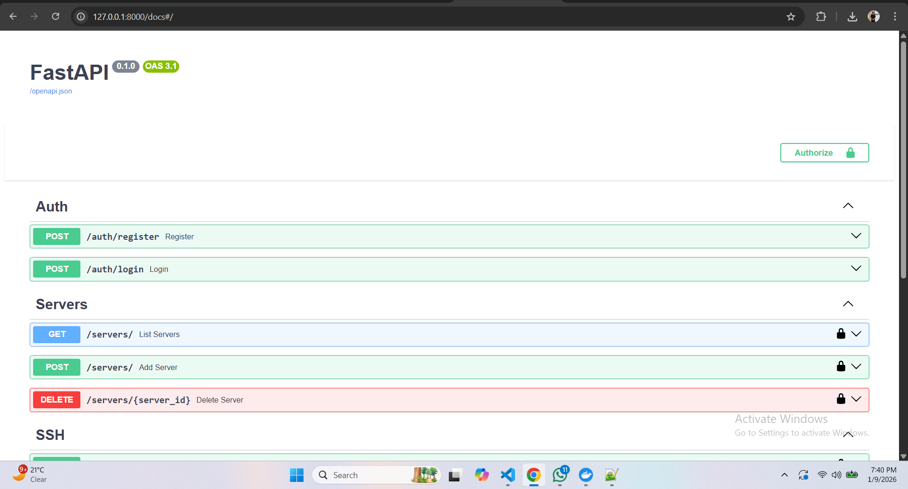

# Remote Server Manager API
A production-ready backend REST API to manage remote Linux servers via SSH, with authentication, command execution, logging, and email notifications.


## Implemented Features

### 1️ User Authentication
- JWT-based user registration and login  
- Secure password hashing using **bcrypt**

---

### 2️ Server Management
- CRUD APIs for managing remote servers  
  - Add Server  
  - List Servers  
  - Delete Server  
- User Profile APIs  
  - Setup Profile  
  - Get Profile  
  - Update Profile  
  - Delete Profile  

---

### 3️ SSH Command Execution
- SSH connection using **Paramiko**
- Execute shell commands on remote servers
- Returns:
  - Command output  
  - Error output  
  - Exit status  
- Dangerous commands are blocked:
  - `rm -rf`
  - `shutdown`
  - `reboot`
  - fork bombs

---

### 4️ Command Logging
- Every executed command is logged in the database
- Stored details:
  - User email
  - Server name
  - Command
  - Output
  - Error
  - Timestamp

---

### 5️ Email Notification
- Integrated with **SendGrid**
- Sends email notification after every command execution
- Email includes:
  - User details
  - Server name
  - Executed command
  - Output
  - Error
  - Exit status

---

### 6️ Docker SSH Test Server
- Docker-based SSH server for testing
- Ubuntu 20.04 container
- SSH exposed on port **2222**
- Used for validating SSH command execution

---

### 7️ Documentation
- Proper `README.md` file included
- Swagger UI available for API testing

---

##  Tech Stack
- **FastAPI**
- **SQLAlchemy**
- **JWT Authentication**
- **Paramiko**
- **SendGrid**
- **Docker**
- **SQLite / PostgreSQL**

---

## 📘 API Documentation
- Swagger UI:  


## Setup
1. Clone repo
2. python -m venv venv
3. pip install -r requirements.txt
4. uvicorn app.main:app --reload

## Test
- Swagger UI: http://127.0.0.1:8000/docs

## to start docker for create shh server for demo
-docker-compose down
-docker-compose up --build -d
-docker ps

## Set environment variables
- Create a .env file in the root directory with:
```python
SECRET_KEY=<your secret key>
DATABASE_URL=<sqlite:///./app.db>
ACCESS_TOKEN_EXPIRE_MINUTES=60
ALGORITHM=HS256
SENDGRID_API_KEY=<"you api key">

```

### Usage

- Register a new user via /auth/register
- Login via /auth/login to get JWT token
- Add a server via /servers/create
- Execute commands via /ssh/execute/{server_id}
- View command logs via /logs

## Images

# Remote Server Manager API

---
